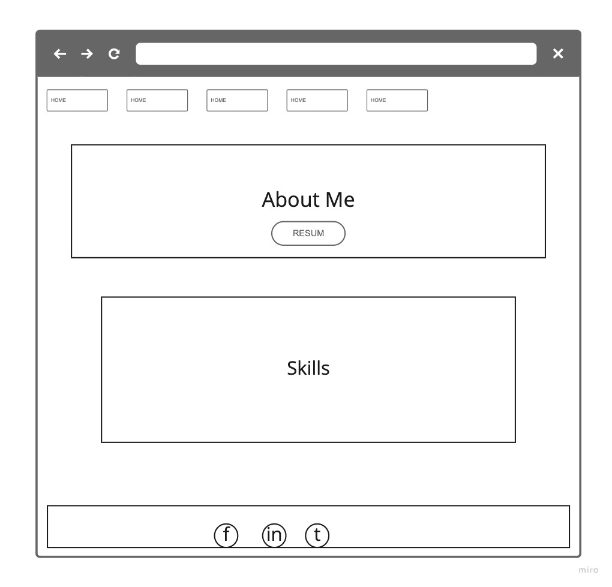
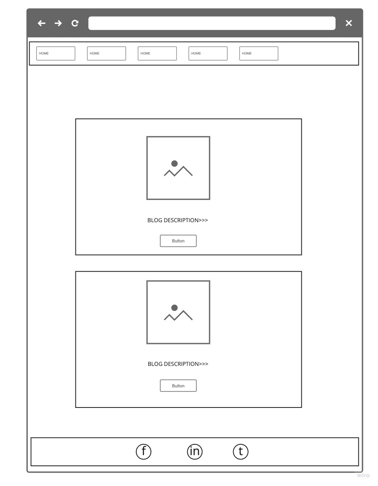
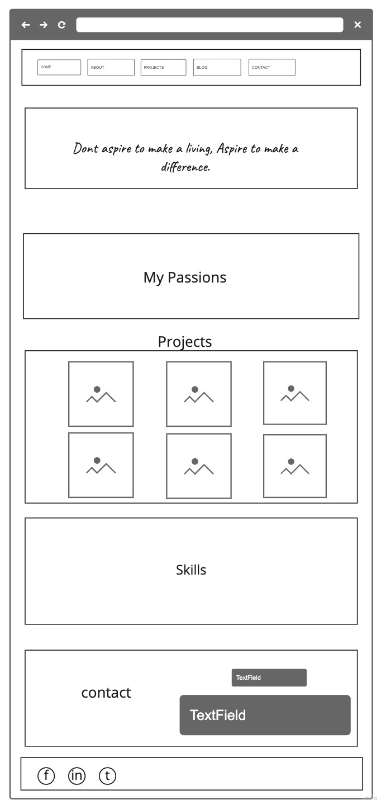
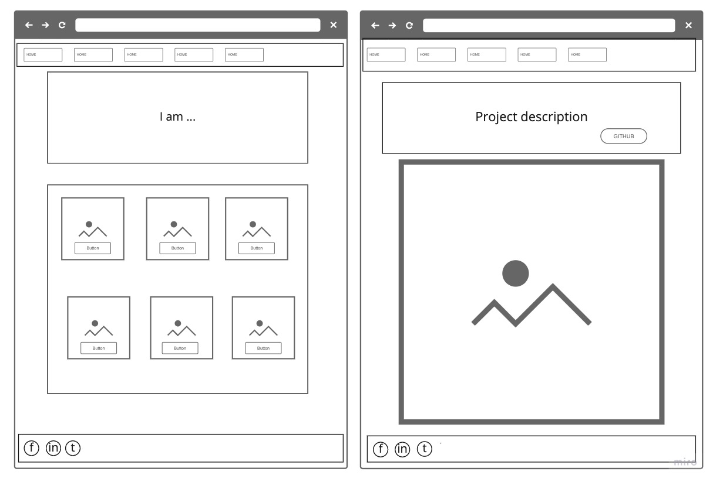

# Jessica Sole Portfolio

-  [Deployed Website](https://jese310s.github.io/)
- [Github]([https://github.com/Jese310S/Jese310S.github.io](https://github.com/Jese310S/Jese310S.github.io))

# About This Website

#### This portfolio website is designed to showcase:
- My completed projects 
- Programming skills 
- Background information about myself
- My Resume
- Contact information

#### Functionality & Features

- The website is designed with a mobile first layout design.  The website has been made responsive for multiple devices.

##### Navigation

Navigating the website is through a responsive navbar.  In desktop mode the navigation menu is displayed at the top of the screen.  When on mobile or ipad screens the navbar changes to a "hamburger" style menu, a three lined menu icon.  When you click on the icon the menu is then displayed.

##### Header
For a header the website uses an image that has been cropped and optimised for use.  The photo is a personal photo of one of my favourite hikes in New Zealand, the Kepler walk.  The header contains a quote that I feel pertains to describing my personality to possible future employers.

##### About
The about section introduces myself and describes a little bit about my background and work history.  There is a link to a resume page that I designed in an online course.  The about section is responsive for every screen view.

##### Resume
The resume is a project completed while taking online courses with Udacity.  The resume is a way to showcase my skills with DOM manipulation and JS.

##### Projects
The projects page of the website is a gallery view of my projects.  It is displayed as a table and is responsive for different views.  When clicking the images the projects github then appears.

##### Blog
The blog section of the website has different blog posts.  The posts were made to look like cards with css.  Each card has an image and the date that the blog post was made.

##### Footer
The footer contains the different way to get in contact with me.  The links are represented by font awesome icons for twitter, instagram, github and linkedin.

## Screenshots

##### Mobile View

##### Tablet View

##### Desktop View

##### WireFrames

## Target Audience

##### The target audience for this website is:
- Fellow peers
- Possible Employers
- Meetups and events

## Tech Stack

- The website was built using HTML, CSS, SASS, and Javascript.
- Trello was used for project management 
- Miro was used to build wireframes for project

